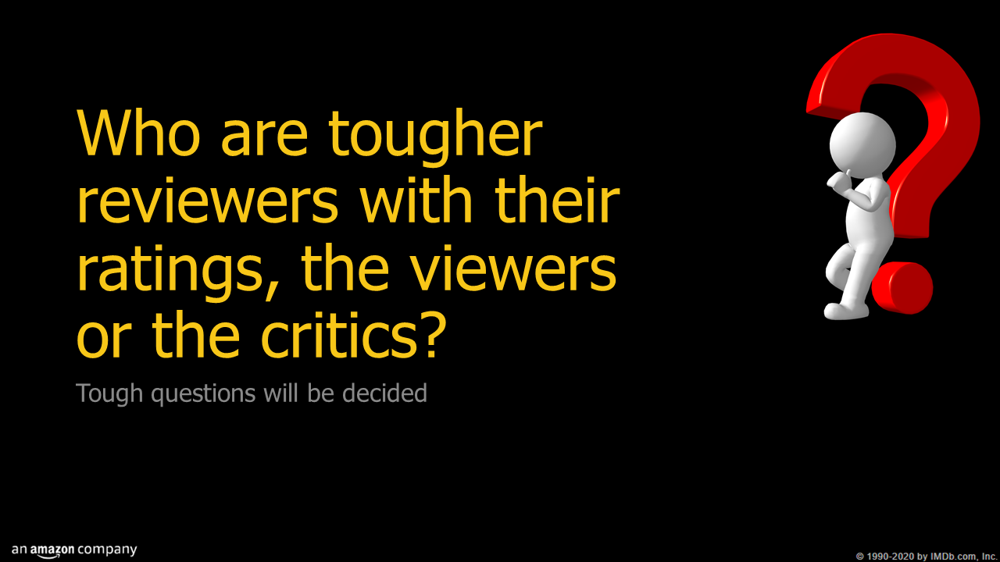
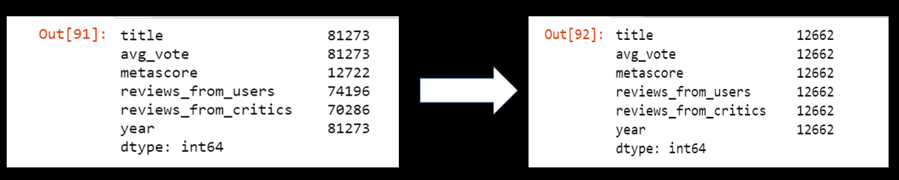
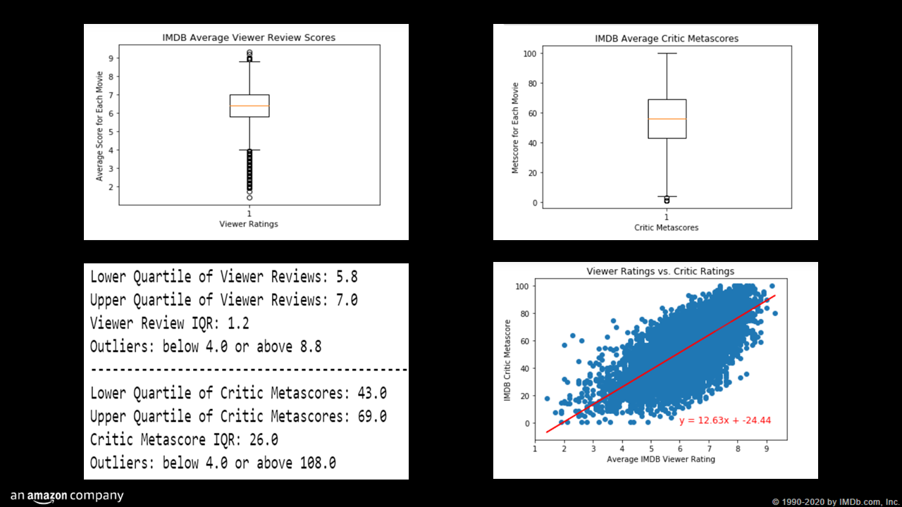
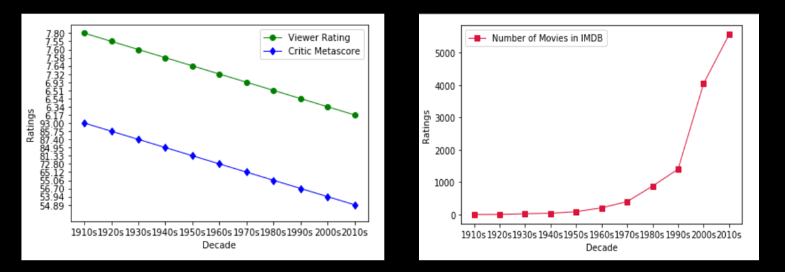
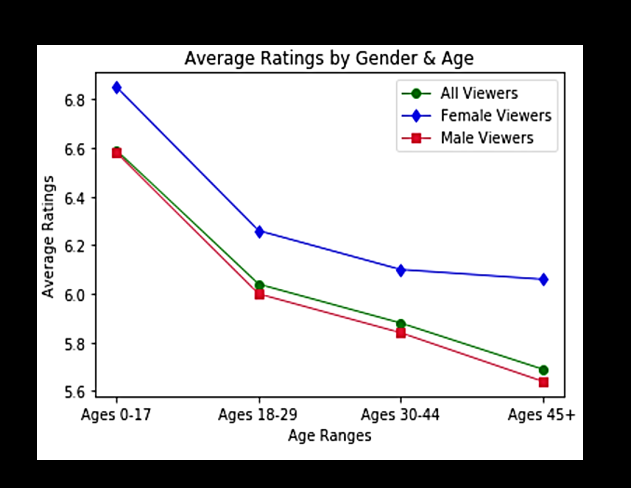

# Critic Scores vs. Viewer Ratings on the Internet Movie Database(IMDb)

## Background
This repository houses my personal contributions to part of a larger data group project related to IMDb. The original project (including commit history) and the full final product is housed in the following [repository](https://github.com/cckuqui/IMDB-movie-data).

The [original dataset](https://www.kaggle.com/stefanoleone992/imdb-extensive-dataset) was retrived from Kaggle and updated by Stefano Leone. This dataset was scraped from IMDb - the most popular movie website on the internet - and divided into 4 categories, with each category housed in its own csv file: 
  * Movies: contains 81,273 movies with 22 attributes.
  * Names (cast members): contains 175,719 cast members with 20 attributes
  * Ratings: contains 81,273 movies with 49 attributes
  * Title Principals (cast members roles): contains 377,848 cast members roles in movies with 6 attributes
  
For the purpose of this project, only two of the csv files were used (Movies and Ratings). The data analysis documented here used Python, specifically the Pandas & Matplotlib libraries, to evaluate the movie ratings data.

## Contents
* The 2 datasets used for this portion of the project analysis
* The jupyter notebook used for all data analysis (via Python)
* The slides used for the project presentation
* A pdf copy of the final Powerpoint presentation

## Research Question:

For the purposes of this project, I attempted to see if the viewer ratings and critic review scores could be compared to determine who, as a group, were the "harsher" critics.

## Definitions 
In order to be able to compare the two measures, it is important to understand how each measure is created and the scale on which it is measured.

WEIGHTED AVERAGE VOTE: IMDb registered users can cast a vote (from 1 to 10) on every released title in the database. Individual votes are then aggregated and summarized as a single IMDb rating. Users can update their votes as often as they’d like, but any new vote on the same title will overwrite the previous one, so it is one vote per title per user.

METACRITIC SCORE: A Metascore is a weighted average where IMDB assigns more importance, or weight, to some critics and publications than others, based on their quality and overall stature. A movie gets a Metascore when IMDB has collected at least four critics' reviews for that movie. Metascores range from 0-100, with higher scores indicating better overall reviews. IMDB also normalizes the resulting scores (akin to "grading on a curve" in college), which prevents scores from clumping together.

## Data Cleaning
Only 74,196 of the total movies listed in IMDB (at the time) had been reviewed by viewers, and only 70,286 had been reviewed by critics. Therefore, the first step is to eliminate the movies that did not have reviews by BOTH viewers and critics.

Additionally, and more importantly, only 12,722 movies had been given a metascore - meaning they were reviewed by at least 4 critics and assigned a score rating the quality of the movie. Without a metascore, a movie had no measure listed related to how critics rated the quality the movie.

Thus, the dataset had to be limited to only the movies with an assigned metascore that had also been reviewed by viewers. After data cleaning, the resulting data set had 12,662 entries, which were used for the final analysis. 

## General Conclusions
Overall, there was a positive correlation between higher viewer scores and critic metascores.

There were far greater numbers of overall user reviews submitted per movie than critic reviews, but more consistency (i.e. less variance and narrower standard deviation) in the number of critic reviews for any given movie received vs. the number of user reviews each movie received. In terms of ratings of movie quality, it should be noted that there are may more outliers present in the viewer review data than the critic metascores, but this in part probably reflects the fact that the metscores have been set to a normal curve as part of IMDB's metscore methodology.

As far as a direct comparison of how well users rated a movie vs. critics, we have to keep in mind that, aside from critic metescores having already been normalized, the viewer ratings are scales from 1-10 while the metascores are scaled 1-100, so they may not be directly comparable without additional statistical analysis. However:
* if we compare the average critic metascore relative to its range (1-100) to the average voter score relative to its range (1-10), viewers do seem to rate movies overall a bit more favorably than critics.

* a closer look at the average ratings and metascores for viewers' and critics' 100 favorite and least favorites movies (as well as the top 5 and bottom 5 titles for each group) confirm that viewers and critics often value different characteristics in their "favorite" movies.  

## Reviews by Movie Decade
On average, both viewers and critics rated movies from the 1960s and earlier higher than movies made in the 1970s and after. However, the vast majority of the movies in IMDB were made in the 1970s and afterwards. It could be that the better the quality of movies made before 1070, the more likely it is to be listed and reviewed on IMDB. More recent movies might be more likely to be listed on IMDB regardless of quality, thus bring the average scores for reviews of recent movies down.

Additional observations:
* An interesting point is the difference in "average year of release" for the viewers' favorite movies (1990), and critics' favorite movies (1973), indicating that critics favor older films more than IMDB users.

* Both IMDB users and critics had similar "average year of release" for bad movies (used as a proxy measure for "worst decade") -- the 2010s for both groups (2007 vs. 2004).

## Gender & Nationality Comparisons
In general, females viewers rated movies slightly more favorably than male viewers. This trend was consistent across all age ranges when the data are divided by age. Older viewers (both male and female) consistently gave less favorable ratings than viewers younger than them.

Average ratings from US viewers also tended to be slightly higher than ratings from viewers in other countries.

